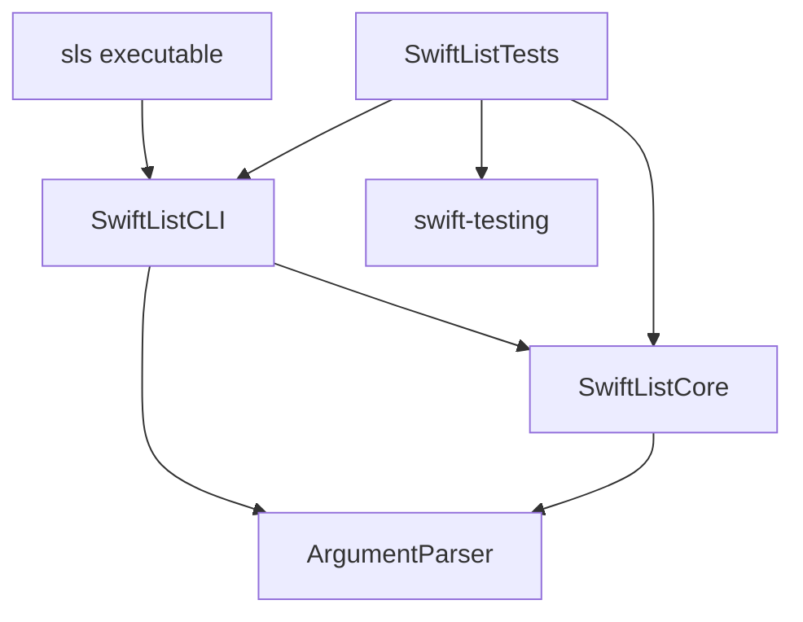

## Project Overview

List is built as a modular Swift package with clear separation of concerns. The project is organized into three main modules that work together to provide a fast, feature-rich file listing tool.

<CardGroup cols={3}>
  <Card title="sls" icon="terminal">
    **Executable Target**
    
    Entry point for the CLI application
  </Card>
  <Card title="SwiftListCLI" icon="sliders">
    **CLI Module**
    
    Command-line interface and argument parsing
  </Card>
  <Card title="SwiftListCore" icon="cubes">
    **Core Library**
    
    Business logic and file system operations
  </Card>
</CardGroup>

## Module Structure

### Dependency Graph



### Module Responsibilities

<Tabs>
  <Tab title="sls (Executable)">
    **Location:** `Sources/SwiftList/main.swift`
    
    The minimal entry point that launches the CLI application:
    
    ```swift
    import SwiftListCLI
    
    ListCommand.main()
    ```
    
    **Purpose:**
    - Single responsibility: bootstrap the application
    - Depends only on SwiftListCLI
    - Keeps the executable target simple and focused
  </Tab>
  
  <Tab title="SwiftListCLI">
    **Location:** `Sources/SwiftListCLI/`
    
    Handles all command-line interface concerns:
    
    **Key Components:**
    - `ListCommand.swift` - Main command implementation using ArgumentParser
    
    **Responsibilities:**
    - Parse command-line arguments and flags
    - Define CLI options (--long, --all, --sort, etc.)
    - Coordinate between user input and core functionality
    - Format and display output to the terminal
    
    **Dependencies:**
    - SwiftListCore (business logic)
    - ArgumentParser (CLI framework)
  </Tab>
  
  <Tab title="SwiftListCore">
    **Location:** `Sources/SwiftListCore/`
    
    Contains the core business logic and file system operations:
    
    **Directory Structure:**
    ```
    SwiftListCore/
    ├── Configuration/
    │   ├── DisplayOptions.swift
    │   └── SortOption.swift
    ├── Models/
    │   └── FileRepresentation.swift
    └── Utilities/
        ├── FileManagerHelper.swift
        └── TerminalColors.swift
    ```
    
    **Responsibilities:**
    - File system operations and traversal
    - Formatting and colorization logic
    - Sorting and filtering algorithms
    - Platform-specific file attribute handling
    
    **Dependencies:**
    - ArgumentParser (for SortOption enum)
    - Foundation (file system access)
    - Darwin/Glibc (platform-specific operations)
  </Tab>
</Tabs>

## Core Components

### ListCommand

**File:** `Sources/SwiftListCLI/ListCommand.swift`

The main command that ties everything together:

```swift
public struct ListCommand: ParsableCommand {
    public static let configuration = CommandConfiguration(
        commandName: "sls",
        version: "1.5.0"
    )
    
    // Flags and options...
    @Flag(name: .shortAndLong) var all = false
    @Flag(name: .shortAndLong) var long = false
    @Option(name: [.customShort("L"), .long]) var depthLimit: Int?
    @Argument var paths: [String] = []
    
    public func run() throws {
        // Build DisplayOptions from flags
        // Call FileManagerHelper.contents()
        // Print results
    }
}
```

**Key Features:**
- Uses Swift ArgumentParser for declarative CLI definition
- Supports 13+ command-line flags and options
- Handles multiple path arguments
- Translates CLI flags into DisplayOptions

### DisplayOptions

**File:** `Sources/SwiftListCore/Configuration/DisplayOptions.swift`

Configuration struct that controls how files are displayed:

<CodeGroup>
```swift Properties
public struct DisplayOptions {
    var location: URL?
    var all: Bool = false              // Show hidden files
    var long: Bool = false             // Long format
    var recurse: Bool = false          // Recursive listing
    var color: Bool = false            // Colorized output
    var icons: Bool = false            // Show file icons
    var oneLine: Bool = false          // One file per line
    var humanReadable: Bool = false    // Human-readable sizes
    var directoryOnly: Bool = false    // List dir itself
    var classify: Bool = false         // Append indicators
    var sortBy: SortOption = .name     // Sort method
    var depthLimit: Int?               // Recursion limit
}
```

```swift Usage
let options = DisplayOptions(
    all: true,
    long: true,
    color: true,
    sortBy: .time
)
let listing = try FileManagerHelper.contents(with: options)
```
</CodeGroup>

### FileManagerHelper

**File:** `Sources/SwiftListCore/Utilities/FileManagerHelper.swift`

The workhorse class that handles all file system operations:

**Key Methods:**

| Method | Purpose |
|--------|--------|
| `contents(with:currentDepth:)` | Main entry point - lists directory contents |
| `fileAttributes(at:with:)` | Retrieves and formats file attributes |
| `determineType(of:attributes:)` | Determines file type (directory, symlink, executable, file) |
| `terminalWidth()` | Gets terminal width for formatting |

**Features:**
- Handles symbolic links correctly (uses `lstat`)
- Supports recursive directory traversal with depth limiting
- Intelligent terminal width wrapping
- Platform-specific file attribute handling (Darwin/Glibc)
- Sorts files by name, size, or modification time

<Tip>
  FileManagerHelper uses `lstat` for symbolic links to get the link's own attributes rather than following the link to its target.
</Tip>

### FileRepresentation

**File:** `Sources/SwiftListCore/Models/FileRepresentation.swift`

Model for file visual representation:

```swift
public struct FileRepresentation {
    let icon: String        // "📁", "📄", "🔗", "⚙️"
    let color: String       // ANSI color code
    let destination: String? // For symlinks
}
```

**File Type Mapping:**
- 📁 Directories (blue)
- 📄 Regular files (white)
- 🔗 Symbolic links (yellow) - shows destination
- ⚙️ Executable files (red)

### SortOption

**File:** `Sources/SwiftListCore/Configuration/SortOption.swift`

Enum defining sort methods:

```swift
public enum SortOption: String, ExpressibleByArgument {
    case name  // Alphabetical (default)
    case time  // Most recent first
    case size  // Largest first
}
```

### TerminalColors

**File:** `Sources/SwiftListCore/Utilities/TerminalColors.swift`

Provides ANSI color codes for terminal output:

- Blue for directories
- Yellow for symbolic links
- Red for executables
- White for regular files
- Reset code to clear formatting

## Data Flow

<Steps>
  <Step title="User Input">
    User runs `sls --long --color /path` in terminal
  </Step>
  
  <Step title="Argument Parsing">
    `ListCommand` (ArgumentParser) parses flags and arguments
  </Step>
  
  <Step title="Options Building">
    CLI flags are converted into a `DisplayOptions` struct
  </Step>
  
  <Step title="File System Query">
    `FileManagerHelper.contents()` is called with options:
    - Lists directory contents
    - Gets file attributes for each item
    - Determines file type (icon & color)
    - Sorts according to sortBy option
  </Step>
  
  <Step title="Formatting">
    Files are formatted based on display options:
    - Long format: permissions, owner, size, date
    - Icons: file type emoji
    - Colors: ANSI escape codes
    - Wrapping: terminal width calculation
  </Step>
  
  <Step title="Output">
    Formatted string is printed to stdout
  </Step>
</Steps>

## Design Patterns

### Separation of Concerns

<CardGroup cols={2}>
  <Card title="CLI Layer" icon="terminal">
    **SwiftListCLI** handles user interaction
    
    - Argument parsing
    - Command definitions
    - User-facing error messages
  </Card>
  <Card title="Business Logic" icon="gears">
    **SwiftListCore** handles implementation
    
    - File system operations
    - Sorting and filtering
    - Formatting logic
  </Card>
</CardGroup>

**Benefits:**
- Core library can be reused in other projects
- Easy to test business logic independently
- Clear boundaries between layers

### Configuration Object

`DisplayOptions` acts as a configuration object passed through the system:

- Immutable options (struct semantics)
- Single source of truth for display behavior
- Easy to extend with new options
- Testable configurations

### Platform Abstraction

Platform-specific code is isolated:

```swift
#if canImport(Darwin)
import Darwin
#elseif canImport(Glibc)
import Glibc
#endif
```

Enables cross-platform support (macOS/Linux) without code duplication.

## Testing Architecture

**Location:** `Tests/SwiftListTests.swift`

Test suite using the modern Swift Testing framework:

- Tests both SwiftListCore and SwiftListCLI modules
- Uses `swift-testing` (0.11.0+) for modern test syntax
- Validates file operations and formatting logic

<Info>
  The project uses Swift Testing instead of XCTest for a more modern testing experience with better ergonomics.
</Info>

## External Dependencies

<AccordionGroup>
  <Accordion title="swift-argument-parser (1.0.0+)">
    **Purpose:** Command-line argument parsing
    
    **Used by:**
    - SwiftListCLI (ListCommand definition)
    - SwiftListCore (SortOption enum)
    
    **Features utilized:**
    - `@Flag`, `@Option`, `@Argument` property wrappers
    - `ParsableCommand` protocol
    - `CommandConfiguration` for metadata
    - Automatic help generation
  </Accordion>
  
  <Accordion title="swift-docc-plugin (1.4.3+)">
    **Purpose:** Documentation generation
    
    **Enables:**
    - `swift package generate-documentation` command
    - API documentation from doc comments
    - Interactive documentation browsing
  </Accordion>
  
  <Accordion title="swift-testing (0.11.0+)">
    **Purpose:** Modern testing framework
    
    **Used in:**
    - SwiftListTests target
    
    **Benefits:**
    - Modern Swift syntax
    - Better error messages
    - Improved test organization
  </Accordion>
</AccordionGroup>

## Code Organization Best Practices

The project follows Swift best practices:

1. **Modular design** - Clear module boundaries
2. **Protocol-oriented** - Uses Swift protocols (ParsableCommand)
3. **Value types** - Structs for DisplayOptions, FileRepresentation
4. **Documentation** - Comprehensive doc comments
5. **Type safety** - Enums for SortOption
6. **Cross-platform** - Conditional compilation for Darwin/Glibc

## Next Steps

<CardGroup cols={2}>
  <Card title="Building" icon="hammer" href="/development/building-from-source">
    Learn how to build the project
  </Card>
  <Card title="Contributing" icon="code-pull-request" href="/development/contributing">
    Start contributing to List
  </Card>
</CardGroup>
